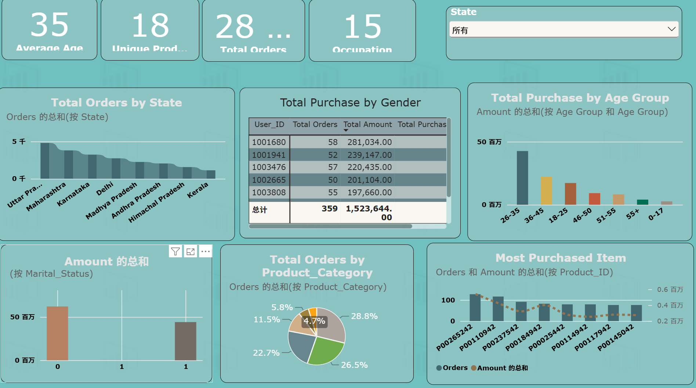
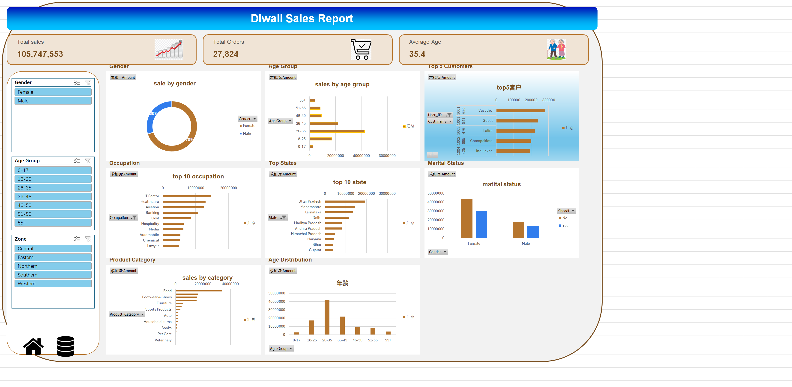

# Diwali Sales Analysis | 排灯节销售数据分析

印度排灯节电商销售数据全流程分析，覆盖 SQL 数据清洗、Python 探索性分析、Excel 交互式看板、Power BI 可视化四个环节。

## 项目背景

排灯节（Diwali）是印度最大的购物季，相当于国内的双十一。数据集包含 11251 条订单记录，涉及用户信息、商品信息、地区、职业、品类、订单金额等字段。通过分析这些数据，回答以下业务问题：

- 核心客户是谁（性别、年龄、婚姻、职业）
- 哪些地区卖得最好
- 什么品类最受欢迎
- 高价值客户有哪些
- 最终输出可交互的 Dashboard 供运营团队使用

## 技术栈

- MySQL 8.0 — 数据清洗 + 业务查询
- Python（Pandas, Matplotlib, Seaborn）— 探索性数据分析
- Excel — 数据透视表 + 透视图 + 切片器交互看板
- Power BI — 多页面可视化看板

## 项目流程

### 1. 数据导入与校验

- 原始 CSV 为 latin-1 编码，导入 MySQL 时字符集选 windows-1252，否则印度邦名会乱码
- 导入后校验行数：11251 行，15 列
- 检查空值：Amount 列有 12 条空值，Status 和 unnamed1 两列全为空

### 2. 数据清洗（SQL）

- 删除 Status、unnamed1 两个空列
- 删除 Amount 为空的 12 条记录
- 字段标准化：Gender 从 F/M 改为 Female/Male；Marital_Status 从 0/1 改为 No/Yes（新列名 Shaadi）
- 自连接去重：MySQL 不支持 CTE 直接 DELETE，用自连接保留 id 最小的行，删除 64 条重复
- 清洗后剩余 11175 行，13 列

### 3. SQL 业务分析

- 性别销售额对比及占比
- 年龄段销售额分布
- 婚姻状态 x 性别交叉分析
- 职业销售额 Top10
- 州（邦）销售额 Top10
- 五大区域销售额对比
- 品类销售额排名
- 年龄段 x 性别交叉
- Top10 畅销商品（RANK 窗口函数）
- Top10 高价值客户（RANK 窗口函数）

### 4. Python 探索性分析

- 数据读取与清洗（处理编码、空值、重复值）
- 性别分布柱状图 + 销售额对比
- 年龄段销售额分布（固定排序）
- 婚姻状态 x 性别交叉分析
- 职业销售额横向条形图
- 州 Top10 + 区域分布
- 品类销售额排名

### 5. Excel 交互式看板

- 9 个数据透视表：KPI 总览、性别、年龄、婚姻 x 性别、职业、州、品类、Top5 客户、年龄 x 性别
- 8 张透视图：性别环形图、年龄条形图、职业 Top10、州 Top10、品类、婚姻状态、Top5 客户、年龄分布
- 3 个切片器：Gender、Age Group、Zone，通过报表连接联动所有图表
- 3 个 KPI 卡片：总销售额 105,747,553、总订单 27,824、平均年龄 35.4

### 6. Power BI 可视化看板

- 三个页面：销售概览、客户分析、品类分析
- 对接清洗后的 MySQL 数据表
- 基于业务 KPI 制作可视化图表
- 配色采用蓝橙系，与官方版本区分

## Python 分析要点

- 读取 CSV 时指定 encoding='unicode_escape'，解决印度文字符编码问题
- 删除空列和空值后，用 drop_duplicates 按多列去重
- 性别、婚姻状态字段用 map 做值替换
- 年龄段分析固定 x 轴顺序，避免默认字母排序导致图表混乱
- 职业和州用横向条形图，标签长时更易读
- 输出清洗后的干净数据集，供 SQL 和 BI 工具直接使用

## SQL 分析要点

- 多维度聚合：按性别、年龄、职业、州、品类分别 GROUP BY 计算销售额和占比
- 交叉分析：婚姻状态 x 性别、年龄段 x 性别，用两个字段 GROUP BY
- 占比计算：用子查询先算总销售额，再相除得到百分比
- 窗口函数：RANK() OVER (ORDER BY SUM(Amount) DESC) 计算商品和客户排名
- 去重技巧：MySQL 不支持 CTE 直接 DELETE，用自连接 t1.id > t2.id 删除重复行
- 字段转换：CASE WHEN 把编码值（F/M、0/1）转成可读文本

示例 SQL 代码：

```sql
-- 性别销售额占比
SELECT Gender,
       SUM(Amount) AS sales,
       ROUND(SUM(Amount) / (SELECT SUM(Amount) FROM diwali_sales_data) * 100, 2) AS pct
FROM diwali_sales_data
GROUP BY Gender
ORDER BY sales DESC;

-- Top10 畅销商品（RANK 窗口函数）
SELECT * FROM (
    SELECT Product_ID,
           SUM(Amount) AS total_sales,
           RANK() OVER (ORDER BY SUM(Amount) DESC) AS sales_rank
    FROM diwali_sales_data
    GROUP BY Product_ID
) t
WHERE sales_rank <= 10;
```

## Power BI 看板功能



- 销售概览页：KPI 卡片（总销售额、总订单、客户数、客单价）+ 性别占比环形图 + 年龄段柱形图
- 客户分析页：职业 Top10 条形图 + 婚姻状态 x 性别柱形图 + Top5 客户表
- 品类分析页：品类销售额条形图 + 州 Top10 条形图 + 区域分布
- 切片器：Gender、Age Group、Zone，跨页面联动筛选
- 数据来源：直接连接 MySQL 的 diwali_sales_data 表，支持刷新

## Excel Dashboard 说明



打开 `excel/Diwali_Sales_Dashboard.xlsx`，切换到 dashboard 工作表：
- 顶部三个 KPI 卡片显示核心指标
- 左侧三个切片器可按性别、年龄段、区域筛选
- 中间 8 张图表随切片器联动更新
- 数据透视表在 KPI Pivot table 工作表，原始数据在 diwali_sales_data 工作表

## 关键发现

- 女性贡献 70% 销售额，是绝对购买主力
- 26-35 岁年龄段贡献最多，占 40%，是核心客群
- 未婚女性贡献最大，占总销售额 41%
- 消费最高的职业是 IT、医疗、航空，合计约 38%
- 北方邦、马哈拉施特拉邦、卡纳塔克邦是销售额前三，合计占 45%
- 中部和南部两个区域合计占 64%
- 食品品类卖得最好（32%），服装、鞋类、电子构成第二梯队
- 核心客户画像：26-35 岁、未婚、IT/医疗/航空行业、来自中部或南部的女性

## 文件结构

```
Diwali-Sales-Analysis/
├── README.md
├── data/
│   ├── raw_diwali_sales.csv      # 原始数据
│   └── clean_diwali_sales.csv    # 清洗后数据
├── sql/
│   ├── 01_data_cleaning.sql      # 数据清洗脚本
│   └── 02_analysis_queries.sql   # 业务分析查询
├── python/
│   └── diwali_eda_analysis.ipynb # EDA notebook
├── excel/
│   └── Diwali_Sales_Dashboard.xlsx
├── powerbi/
│   └── Diwali_Sales_Dashboard.pbix
└── images/
    └── Dashboard.png
```

## 怎么运行

SQL：创建 diwali 数据库，用 DataGrip 导入 raw_diwali_sales.csv（编码选 windows-1252），依次执行 01_data_cleaning.sql 和 02_analysis_queries.sql。

Python：pip install pandas matplotlib seaborn，用 Jupyter 打开 python/diwali_eda_analysis.ipynb。

Excel：直接打开 excel/Diwali_Sales_Dashboard.xlsx，切到 dashboard 工作表点切片器筛选。

Power BI：打开 powerbi/Diwali_Sales_Dashboard.pbix，转换数据 → 数据源设置 → 连接自己的 MySQL 或 CSV。

